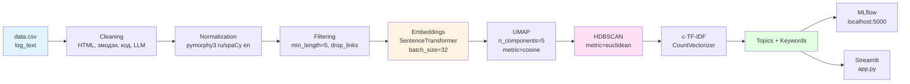

# AutoTopic: Автоматический тематический анализ текстовых логов

**Автоматическое выявление и интерпретация скрытых тем в неструктурированных текстовых логах для ускорения анализа инцидентов и принятия продуктовых решений.**

[](https://www.python.org/downloads/)
[](https://maartengr.github.io/BERTopic/)
[](https://optuna.org/)
[](https://mlflow.org/)

---

## 🎯 Проблема и бизнес-контекст

### Откуда данные?
Проект анализирует текстовые данные из CSV файлов с колонкой `log_text`. Поддерживается обработка русских и английских текстов.

### Какую ценность дают результаты?
- **Автоматическая группировка**: Похожие тексты автоматически группируются в темы
- **Выявление паттернов**: Обнаружение скрытых тем без предварительной разметки
- **Качественные метрики**: Coherence и Diversity позволяют оценить интерпретируемость найденных тем

### Почему тематическое моделирование?
BERTopic объединяет семантические эмбеддинги с кластеризацией для автоматического обнаружения тем без предварительной разметки.

---

## 🛠️ Технологический стек

### Основные библиотеки

| Категория | Библиотека | Назначение |
|-----------|-----------|------------|
| **Topic Modeling** | `bertopic` | Тематическое моделирование на базе BERT |
| **Embeddings** | `sentence-transformers` | Многоязычные эмбеддинги (`paraphrase-multilingual-MiniLM-L12-v2`) |
| **Clustering** | `hdbscan` | Плотностная кластеризация |
| **Dimensionality Reduction** | `umap-learn` | Снижение размерности перед кластеризацией |
| **Optimization** | `optuna` | Автоматическая оптимизация гиперпараметров |
| **Experiment Tracking** | `mlflow` | Логирование экспериментов, метрик и артефактов |
| **NLP Processing** | `spacy` | Морфологический анализ, стоп-слова |
| **Russian NLP** | `pymorphy3` | Лемматизация для русского языка |
| **Visualization** | `streamlit` | Интерактивный веб-интерфейс |
| **Word Clouds** | `wordcloud` | Визуализация ключевых слов тем |
| **Data Processing** | `pandas` | Обработка данных |
| **Metrics** | `gensim` | Оценка coherence тем |
| **Text Cleaning** | `beautifulsoup4` | Парсинг и очистка HTML |
| **Logging** | `loguru` | Логирование |

**Язык**: Python 3.10+  
**GPU**: Опционально (CUDA для ускорения эмбеддингов)

Полный список зависимостей с версиями: [`requirements.txt`](requirements.txt)

---

## 📦 Установка

### 1. Клонирование репозитория

```bash
git clone https://github.com/yourusername/AutoTopic.git
cd AutoTopic
```

### 2. Создание окружения

**Через Conda (рекомендуется):**

```bash
# Создание conda окружения
conda create -n autotopic python=3.10 -y
conda activate autotopic

# Установка через pip
pip install -r requirements.txt

# Установка PyTorch (выберите нужную версию)
# Для CPU:
pip install torch torchvision torchaudio --index-url https://download.pytorch.org/whl/cpu

# ИЛИ для CUDA 11.8:
# pip install torch torchvision torchaudio --index-url https://download.pytorch.org/whl/cu118
```

**Через venv:**

```bash
python -m venv venv
source venv/bin/activate  # Linux/Mac
# или
venv\Scripts\activate     # Windows

pip install -r requirements.txt

# Установка PyTorch (см. выше)
```

### 3. Установка spaCy моделей

```bash
python -m spacy download ru_core_news_sm
python -m spacy download en_core_web_sm
```

### 4. Проверка установки

```bash
python -c "import bertopic, sentence_transformers, mlflow, optuna, streamlit; print('✅ Все библиотеки установлены!')"
```

---

## 📁 Структура проекта

```
AutoTopic/
├── config.yaml                 # Централизованная конфигурация пайплайна
├── main.py                     # Главный скрипт запуска пайплайна с MLflow
├── app.py                      # Streamlit веб-интерфейс
├── create_sample.py            # Создание сэмпла для оптимизации (10% данных)
├── requirements.txt            # Зависимости Python
├── README.md                   # Документация проекта
│
├── pipeline/                   # Переиспользуемые компоненты пайплайна
│   ├── cache.py               # Кэширование промежуточных результатов (Parquet)
│   ├── metrics.py             # Метрики качества (coherence_uci, coherence_umass, diversity)
│   ├── viz.py                 # Визуализация результатов (графики, wordcloud)
│   └── optuna_tune.py         # Оптимизация гиперпараметров через Optuna
│
├── stages/                     # Этапы обработки данных (модульная архитектура)
│   ├── cleaning.py            # Очистка текста (HTML, эмодзи, код, ссылки, LLM-модели)
│   ├── normalization.py       # Лемматизация (ru через pymorphy3, en через spaCy)
│   ├── filtering.py           # Фильтрация по длине и ссылкам
│   ├── embedding.py           # Вычисление эмбеддингов через SentenceTransformers
│   └── topic_modeling.py      # Обучение BERTopic модели (UMAP + HDBSCAN + c-TF-IDF)
│
├── cache/                      # Автогенерация: закэшированные эмбеддинги и модели
├── word_topic/                 # Автогенерация: визуализации тем (PNG)
└── mlruns/                     # Автогенерация: артефакты MLflow экспериментов
```

---

## 🚀 Как запустить

### Базовый запуск через main.py (с MLflow)

```bash
# 1. Подготовьте CSV файл с колонкой 'log_text' в корне проекта
# data.csv:
# log_text
# "Текст для анализа на русском языке"
# "Text for analysis in English"

# 2. Запустите MLflow сервер (в отдельном терминале)
mlflow ui --backend-store-uri sqlite:///mlflow.db --port 5000

# 3. Запустите пайплайн
python main.py
```

Пайплайн выполнит:
1. **Этап 1** (если `tuning.enabled: true`): Создание сэмпла 10% данных (`create_sample_data` с `frac=0.10`) → оптимизация гиперпараметров через Optuna
2. **Этап 2**: Обучение финальной модели на полных данных (`data.csv`) с лучшими параметрами
3. **Логирование**: Все метрики и артефакты сохраняются в MLflow на `http://localhost:5000`

### Запуск веб-интерфейса (Streamlit)

```bash
streamlit run app.py
```

**Возможности интерфейса:**
- 📤 Загрузка CSV и выбор текстовой колонки (по умолчанию `log_text`)
- 🔧 Выбор модели: **BERTopic**, **LDA**, **NIP (API)** - последний не реализован
- ⚙️ Настройка гиперпараметров в реальном времени через sidebar
- 🎯 Опциональный тюнинг через Optuna (20 trials для Streamlit)
- 📊 Визуализации (размеры тем, метрики)
- 💾 Выгрузка JSON-отчёта с ключевыми словами и примерами документов
- 🖥️ Переключение устройства (CPU/GPU)

### Просмотр экспериментов в MLflow

```bash
# Если сервер уже запущен на localhost:5000
# Откройте http://localhost:5000 в браузере

# Или запустите локально:
mlflow ui --backend-store-uri sqlite:///mlflow.db
```

---

## 📊 Результаты и визуализации

### Распределение тем

После выполнения пайплайна автоматически генерируется график размеров тем:

```
📈 word_topic/topic_sizes.png
```

График создаётся через `plot_topic_sizes()` и показывает количество документов в каждой теме.

### Облака слов для каждой темы

Для каждой найденной темы (кроме темы -1, шум) создаётся wordcloud с топ-словами:

```
☁️ word_topic/wordcloud_{topic_id}.png
```

Размер облака: 800x400 пикселей, белый фон.

### Метрики качества

Проект автоматически вычисляет следующие метрики через `evaluate_topics()`:

| Метрика | Описание | Формула |
|---------|----------|---------|
| `n_topics` | Количество обнаруженных тем (исключая тему -1) | `len(topics)` |
| `coherence_uci` | Семантическая связность тем (c_uci через Gensim) | CoherenceModel с `coherence="c_uci"` |
| `coherence_umass` | Альтернативная метрика coherence (u_mass) | CoherenceModel с `coherence="u_mass"` |
| `diversity` | Разнообразие слов в темах | `len(unique_words) / len(all_words)` |

Метрики логируются в MLflow и выводятся в консоль через `logger.info()`.

---

## 🏗️ Архитектура пайплайна



### Описание этапов (из кода):

1. **Cleaning** (`stages/cleaning.py`): 
   - Удаление префиксов "Текстовый запрос (модель: ...):"
   - Удаление HTML через BeautifulSoup
   - Удаление эмодзи через библиотеку `emoji`
   - Удаление ссылок (http/https/www, доменных, email)
   - Удаление инлайн-кода и кодовых блоков (```...```)
   - Удаление ключевых слов кода (import, class, def и др.)
   - Удаление упоминаний LLM-моделей (GPT, Claude, Gemini и др.)
   - Удаление чисел
   - Фильтрация символов (только кириллица/латиница в зависимости от режима)
   - Удаление стоп-слов (ru/en + кастомные)
   - Фильтрация по длине: `min_len=10, max_len=500` токенов

2. **Normalization** (`stages/normalization.py`): 
   - Для `language="ru"`: лемматизация через `pymorphy3.MorphAnalyzer()`
   - Для `language="en"`: лемматизация через `spacy.load("en_core_web_sm")`
   - Для `language="multi"`: без нормализации

3. **Filtering** (`stages/filtering.py`): 
   - Удаление текстов со ссылками (если `drop_links: true`)
   - Удаление текстов короче `min_length` (по умолчанию 5 слов)

4. **Embeddings** (`stages/embedding.py`): 
   - Модель: `paraphrase-multilingual-MiniLM-L12-v2`
   - Batch size: 32 (из config)
   - Device: `cuda` или `cpu` (из config)

5. **UMAP** (`stages/topic_modeling.py`): 
   - `n_components=5` (фиксировано в коде)
   - `metric="cosine"` (фиксировано в коде)
   - `n_neighbors` и `min_dist` - настраиваемые параметры

6. **HDBSCAN** (`stages/topic_modeling.py`): 
   - `metric="euclidean"` (фиксировано в коде)
   - `prediction_data=True` (для predict новых документов)
   - `min_cluster_size` синхронизируется с `min_topic_size`

7. **c-TF-IDF** (`stages/topic_modeling.py`): 
   - `CountVectorizer` с настраиваемыми `min_df`, `max_df`, `n_gram_range`
   - Token pattern зависит от `language_mode`: `ru_only` или `mixed`

8. **MLflow**: Логирование в `http://localhost:5000`, эксперимент `topic_analysis`

---

## 📈 Оценка качества и гиперпараметры

### Метрики качества

Проект использует **composite objective** для оптимизации (из `pipeline/optuna_tune.py`):

```python
score = coherence_uci + 0.2 × diversity
```

**Coherence (c_uci)** измеряет семантическую связность слов внутри темы через co-occurrence в документах (реализация через `gensim.models.coherencemodel.CoherenceModel`).

**Diversity** оценивает уникальность слов: `diversity = len(set(all_words)) / len(all_words)`. Высокая diversity означает, что темы не дублируют друг друга.

**Pruning критерии** (из кода):
- Trial отсекается если `n_topics < 2` или `diversity < 0.05`

### Процесс оптимизации (из кода)

1. **Сэмплирование**: Создание сэмпла 10% данных (`frac=0.10`, `random_state=42`) для быстрой итерации
2. **Optuna TPE Sampler**: `TPESampler(seed=42)` для эффективного поиска
3. **Оптимизируемые параметры** (из `pipeline/optuna_tune.py`):
   - `min_topic_size`: [10, 50] (шаг 5)
   - `nr_topics`: [40, 75] (шаг 5)
   - `umap_n_neighbors`: [10, 50]
   - `umap_min_dist`: [0.0, 0.8]
   - `vectorizer.min_df`: [3, 20]
   - `vectorizer.max_df`: [0.70, 0.98]
   - `top_n_words`: [8, 20]
   - `n_gram_range`: (1,1) или (1,2) (categorical)
4. **Количество trials**: 
   - В `main.py`: из `config.yaml` (`n_trials: 30` по умолчанию)
   - В `app.py`: зафиксировано `n_trials=20`

### Параметры из config.yaml (текущие значения)

```yaml
topic_modeling:
  n_gram_range: [1, 2]
  min_topic_size: 15
  umap_n_neighbors: 40
  hdbscan_min_cluster_size: 15  # синхронизируется с min_topic_size
  nr_topics: 60
  umap_min_dist: 0.56
  random_state: 42
  top_n_words: 12
  vectorizer:
    min_df: 3
    max_df: 0.89
  language_mode: mixed  # ru_only | mixed

embedding:
  model: "sentence-transformers/paraphrase-multilingual-MiniLM-L12-v2"
  batch_size: 32
  device: "cuda"

tuning:
  enabled: true
  n_trials: 30
  timeout: null
```

---

## 🔧 Конфигурация

Полная структура `config.yaml`:

```yaml
data:
  input_file: "data/raw_texts.csv"  # Не используется в main.py (используется data.csv)
  output_file: "data/topics.csv"
  text_column: "content"

cleaning:
  remove_html: true
  remove_emojis: true
  stopwords: ["и", "в", "на", "это"]

normalization:
  language: "ru"  # ru / en / multi
  lemmatize: true

filtering:
  min_length: 5
  drop_links: true

embedding:
  model: "sentence-transformers/paraphrase-multilingual-MiniLM-L12-v2"
  batch_size: 32
  device: "cuda"

topic_modeling:
  n_gram_range: [1, 2]
  min_topic_size: 15
  umap_n_neighbors: 40
  hdbscan_min_cluster_size: 15
  nr_topics: 60
  umap_min_dist: 0.56
  random_state: 42
  top_n_words: 12
  vectorizer:
    min_df: 3
    max_df: 0.89
  language_mode: mixed  # ru_only | mixed

tuning:
  enabled: true
  n_trials: 30
  timeout: null
```

---

## 🚨 Устранение неполадок

### Ошибка "No module named 'spacy'"

```bash
pip install spacy
python -m spacy download ru_core_news_sm en_core_web_sm
```

### Проблемы с CUDA / GPU

```bash
# Установка CPU версии PyTorch
pip install torch torchvision torchaudio --index-url https://download.pytorch.org/whl/cpu

# Или для CUDA 11.8:
pip install torch torchvision torchaudio --index-url https://download.pytorch.org/whl/cu118
```

### MLflow сервер не запущен

В `main.py` используется `mlflow.set_tracking_uri("http://localhost:5000")`. Запустите сервер:

```bash
mlflow ui --backend-store-uri sqlite:///mlflow.db --port 5000
```

Или измените в `main.py` на локальный SQLite:
```python
mlflow.set_tracking_uri("sqlite:///mlflow.db")
```

### Ошибка "Expected column 'log_text' in data.csv"

Убедитесь, что ваш CSV файл содержит колонку `log_text` (или измените в `create_sample.py`).

### Проблемы с памятью на больших датасетах

Увеличьте `batch_size` в `config.yaml`:
```yaml
embedding:
  batch_size: 64  # вместо 32
```

---

## 📚 Полезные ссылки

- [BERTopic Documentation](https://maartengr.github.io/BERTopic/) - основная библиотека для тематического моделирования
- [Optuna](https://optuna.org/) - оптимизация гиперпараметров
- [MLflow](https://mlflow.org/) - отслеживание экспериментов
- [spaCy](https://spacy.io/) - обработка естественного языка
- [Sentence Transformers](https://www.sbert.net/) - многоязычные эмбеддинги
- [pymorphy3](https://github.com/kmike/pymorphy3) - морфологический анализ для русского языка

---


⭐ **Если проект оказался полезным, поставьте звезду!**

