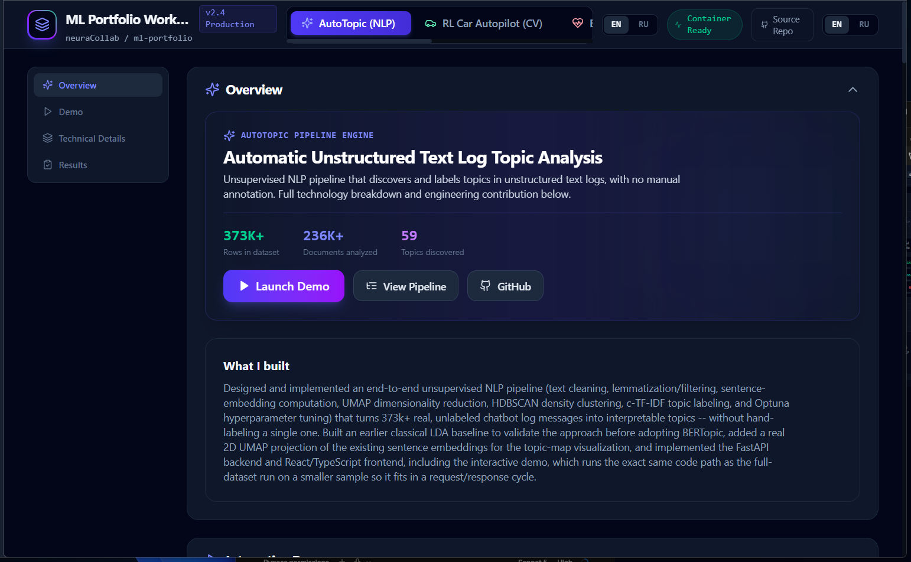
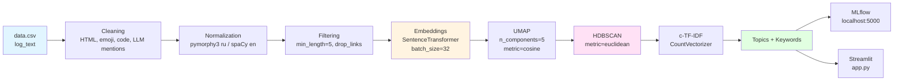

# AutoTopic: Automatic Topic Analysis for Unstructured Text Logs

**Automatically discovers and interprets latent topics in unstructured text logs, to speed up incident analysis and product decisions.**

[](https://www.python.org/downloads/)
[](https://maartengr.github.io/BERTopic/)
[](https://optuna.org/)
[](https://mlflow.org/)

---



## Overview

The project analyzes text data from CSV files with a `log_text` column. It supports both Russian
and English text, and also ships with a real, large (373k+ row) real-world dataset of Russian
LLM-prompt logs (see `data/README.md`) for a genuine at-scale demonstration, not just a toy
sample.

- **Automatic grouping**: similar texts are automatically clustered into topics.
- **Pattern discovery**: finds latent topics with no manual labeling required.
- **Quality metrics**: coherence and diversity scores make the discovered topics' quality and
  interpretability measurable, not just eyeballed.
- **Why topic modeling**: BERTopic combines semantic embeddings with density-based clustering to
  discover topics automatically, without any pre-labeled training data.

## Project Presentation

The portfolio's AutoTopic page has a "Project Presentation" button controlled by
`VITE_AUTOTOPIC_PRESENTATION_URL` (see root `.env.example` and
`frontend/.env.example`):

```
VITE_AUTOTOPIC_PRESENTATION_URL=<REPLACE_WITH_GOOGLE_DRIVE_URL>
```

It's a frontend build-time variable (baked in via `frontend/Dockerfile`'s
`ARG`/`ENV`, wired through `docker-compose.yml`), unlike `AUTOTOPIC_DATA_URL`
above which is read by the backend at request time. **Replace the placeholder**
in `.env.example` (or your own `.env` / deployment environment) with the real
Google Drive share link once the presentation slides are uploaded there. Until
it's replaced, the button renders disabled with a "not yet configured" tooltip
instead of linking anywhere.

## Tech Stack

| Category | Library | Purpose |
|-----------|-----------|------------|
| Topic modeling | `bertopic` | BERT-embedding-based topic modeling |
| Embeddings | `sentence-transformers` | Multilingual embeddings (`paraphrase-multilingual-MiniLM-L12-v2`) |
| Clustering | `hdbscan` | Density-based clustering |
| Dimensionality reduction | `umap-learn` | Reduces embedding dimensionality before clustering |
| Hyperparameter optimization | `optuna` | Automatic hyperparameter search |
| Experiment tracking | `mlflow` | Logs experiments, metrics, and artifacts |
| NLP processing | `spacy` | Morphological analysis, stop words |
| Russian NLP | `pymorphy3` | Russian-language lemmatization |
| Web interface | `streamlit` | Interactive web UI |
| Word clouds | `wordcloud` | Visualizes each topic's top keywords |
| Data processing | `pandas` / `pyarrow` | Tabular data handling (CSV and Parquet) |
| Metrics | `gensim` | Topic coherence evaluation |
| Text cleaning | `beautifulsoup4` | HTML parsing/cleanup |
| Logging | `loguru` | Structured logging |

**Language**: Python 3.10+
**GPU**: optional (CUDA speeds up embedding computation)

Full pinned dependency list: [`requirements.txt`](requirements.txt)

---

## Installation

### 1. Clone the repository

```bash
git clone https://github.com/yourusername/AutoTopic.git
cd AutoTopic
```

### 2. Create an environment

**Via Conda (recommended):**

```bash
conda create -n autotopic python=3.10 -y
conda activate autotopic

pip install -r requirements.txt

# CPU:
pip install torch torchvision torchaudio --index-url https://download.pytorch.org/whl/cpu
# or CUDA 11.8:
# pip install torch torchvision torchaudio --index-url https://download.pytorch.org/whl/cu118
```

**Via venv:**

```bash
python -m venv venv
source venv/bin/activate  # Linux/Mac
# or
venv\Scripts\activate     # Windows

pip install -r requirements.txt
# then install torch as above
```

### 3. Install spaCy models

```bash
python -m spacy download ru_core_news_sm
python -m spacy download en_core_web_sm
```

### 4. Verify the install

```bash
python -c "import bertopic, sentence_transformers, mlflow, optuna, streamlit; print('All libraries installed!')"
```

---

## Project Structure

```
AutoTopic/
├── config.yaml                 # Centralized pipeline configuration
├── main.py                     # Main pipeline entry point, with MLflow logging
├── app.py                      # Streamlit web UI
├── create_sample.py            # Builds a 10% sample for hyperparameter tuning
├── requirements.txt            # Python dependencies
├── README.md                   # This file
├── data/                       # Real dataset + config for it (see data/README.md)
│
├── pipeline/                    # Reusable pipeline components
│   ├── cache.py                # Caches intermediate results (Parquet)
│   ├── metrics.py               # Quality metrics (coherence_uci, coherence_umass, diversity)
│   ├── viz.py                   # Result visualization (charts, wordclouds)
│   └── optuna_tune.py           # Hyperparameter optimization via Optuna
│
├── stages/                      # Data-processing stages (modular pipeline)
│   ├── cleaning.py              # Text cleaning (HTML, emoji, code, links, LLM-model mentions)
│   ├── normalization.py         # Lemmatization (pymorphy3 for ru, spaCy for en)
│   ├── filtering.py             # Length- and link-based filtering
│   ├── embedding.py             # SentenceTransformers embedding computation
│   └── topic_modeling.py        # BERTopic training (UMAP + HDBSCAN + c-TF-IDF)
│
├── cache/                       # Auto-generated: cached embeddings and models
├── word_topic/                  # Auto-generated: topic visualizations (PNG)
└── mlruns/                      # Auto-generated: MLflow experiment artifacts
```

---

## How to Run

### Basic run via main.py (with MLflow)

```bash
# 1. Prepare a CSV file with a 'log_text' column in the project root
# data.csv:
# log_text
# "Text to analyze in Russian"
# "Text for analysis in English"

# 2. Start the MLflow server (in a separate terminal)
mlflow ui --backend-store-uri sqlite:///mlflow.db --port 5000

# 3. Run the pipeline
python main.py
```

The pipeline runs:
1. **Stage 1** (if `tuning.enabled: true`): builds a 10% sample (`create_sample_data`,
   `frac=0.10`) then optimizes hyperparameters via Optuna.
2. **Stage 2**: trains the final model on the full dataset (`data.csv`) with the best
   parameters found.
3. **Logging**: all metrics and artifacts are logged to MLflow at `http://localhost:5000`.

### Running the web UI (Streamlit)

```bash
streamlit run app.py
```

**UI features:**
- Upload a CSV and pick the text column (default `log_text`).
- Choose a model: **BERTopic**, **LDA**, or **NIP (API)** -- the last one is not implemented.
- Live hyperparameter tuning via the sidebar.
- Optional Optuna tuning (20 trials in the Streamlit app).
- Visualizations (topic sizes, metrics).
- Download a JSON report with keywords and example documents.
- CPU/GPU device toggle.

### Viewing experiments in MLflow

```bash
# If a server is already running at localhost:5000, open it in a browser.
# Or run one locally:
mlflow ui --backend-store-uri sqlite:///mlflow.db
```

---

## Results and Visualizations

### Topic size distribution

A chart of topic sizes is generated automatically after the pipeline runs:

```
word_topic/topic_sizes.png
```

Generated by `plot_topic_sizes()`, showing document count per topic.

### Word clouds per topic

For every discovered topic (except topic -1, noise), a wordcloud of its top keywords is
generated:

```
word_topic/wordcloud_{topic_id}.png
```

Wordcloud size: 800x400 pixels, white background.

### Quality metrics

The project automatically computes the following metrics via `evaluate_topics()`:

| Metric | Description | Formula |
|---------|----------|---------|
| `n_topics` | Number of discovered topics (excluding topic -1) | `len(topics)` |
| `coherence_uci` | Semantic coherence of topics (Gensim c_uci) | `CoherenceModel(coherence="c_uci")` |
| `coherence_umass` | Alternative coherence metric (u_mass) | `CoherenceModel(coherence="u_mass")` |
| `diversity` | Word diversity across topics | `len(unique_words) / len(all_words)` |

Metrics are logged to MLflow and printed to the console via `logger.info()`.

---

## Pipeline Architecture



### Stage descriptions (from the code)

1. **Cleaning** (`stages/cleaning.py`):
   - Strips "Текстовый запрос (модель: ...):" style prefixes.
   - Removes HTML via BeautifulSoup.
   - Removes emoji via the `emoji` library.
   - Removes links (http/https/www, bare domains, emails).
   - Removes inline code and fenced code blocks (```...```).
   - Removes common code keywords (import, class, def, etc.).
   - Removes mentions of LLM model names (GPT, Claude, Gemini, etc.).
   - Removes numbers.
   - Filters characters (Cyrillic-only or Cyrillic+Latin, depending on mode).
   - Removes stop words (ru/en + custom domain stop words).
   - Filters by length: `min_len=10, max_len=500` tokens (defaults).

2. **Normalization** (`stages/normalization.py`):
   - For `language="ru"`: lemmatization via `pymorphy3.MorphAnalyzer()`.
   - For `language="en"`: lemmatization via `spacy.load("en_core_web_sm")`.
   - For `language="multi"`: no normalization applied.

3. **Filtering** (`stages/filtering.py`):
   - Drops texts containing links (if `drop_links: true`).
   - Drops texts shorter than `min_length` (default 5 words).

4. **Embeddings** (`stages/embedding.py`):
   - Model: `paraphrase-multilingual-MiniLM-L12-v2`.
   - Batch size: 32 (from config).
   - Device: `cuda` or `cpu` (from config).

5. **UMAP** (`stages/topic_modeling.py`):
   - `n_components=5` (fixed in code).
   - `metric="cosine"` (fixed in code).
   - `n_neighbors` and `min_dist` are configurable.

6. **HDBSCAN** (`stages/topic_modeling.py`):
   - `metric="euclidean"` (fixed in code).
   - `prediction_data=True` (to support predicting on new documents).
   - `min_cluster_size` is synced with `min_topic_size`.

7. **c-TF-IDF** (`stages/topic_modeling.py`):
   - `CountVectorizer` with configurable `min_df`, `max_df`, `n_gram_range`.
   - Token pattern depends on `language_mode`: `ru_only` or `mixed`.

8. **MLflow**: logs to `http://localhost:5000`, experiment `topic_analysis`.

---

## Evaluation & Hyperparameters

### Quality metrics

The project uses a **composite objective** for tuning (from `pipeline/optuna_tune.py`):

```python
score = coherence_uci + 0.2 x diversity
```

**Coherence (c_uci)** measures how semantically related the top words within a topic are, based
on how often they co-occur across documents (via `gensim.models.coherencemodel.CoherenceModel`).

**Diversity** measures word uniqueness: `diversity = len(set(all_words)) / len(all_words)`. High
diversity means topics don't duplicate each other's vocabulary.

**Pruning criteria** (from the code):
- A trial is pruned if `n_topics < 2` or `diversity < 0.05`.

### Optimization process (from the code)

1. **Sampling**: builds a 10% sample (`frac=0.10`, `random_state=42`) for fast iteration.
2. **Optuna TPE sampler**: `TPESampler(seed=42)` for efficient search.
3. **Tuned parameters** (from `pipeline/optuna_tune.py`):
   - `min_topic_size`: [10, 50] (step 5)
   - `nr_topics`: [40, 75] (step 5)
   - `umap_n_neighbors`: [10, 50]
   - `umap_min_dist`: [0.0, 0.8]
   - `vectorizer.min_df`: [3, 20]
   - `vectorizer.max_df`: [0.70, 0.98]
   - `top_n_words`: [8, 20]
   - `n_gram_range`: (1,1) or (1,2) (categorical)
4. **Number of trials**:
   - In `main.py`: from `config.yaml` (`n_trials: 30` by default).
   - In `app.py`: fixed at `n_trials=20`.

### Current values from config.yaml

```yaml
topic_modeling:
  n_gram_range: [1, 2]
  min_topic_size: 15
  umap_n_neighbors: 40
  hdbscan_min_cluster_size: 15  # synced with min_topic_size
  nr_topics: 60
  umap_min_dist: 0.56
  random_state: 42
  top_n_words: 12
  vectorizer:
    min_df: 3
    max_df: 0.89
  language_mode: mixed  # ru_only | mixed

embedding:
  model: "sentence-transformers/paraphrase-multilingual-MiniLM-L12-v2"
  batch_size: 32
  device: "cuda"

tuning:
  enabled: true
  n_trials: 30
  timeout: null
```

---

## Configuration

The full structure of `config.yaml`:

```yaml
data:
  input_file: "data/raw_texts.csv"  # Not used by main.py (which reads data.csv instead)
  output_file: "data/topics.csv"
  text_column: "content"

cleaning:
  remove_html: true
  remove_emojis: true
  stopwords: ["и", "в", "на", "это"]

normalization:
  language: "ru"  # ru / en / multi
  lemmatize: true

filtering:
  min_length: 5
  drop_links: true

embedding:
  model: "sentence-transformers/paraphrase-multilingual-MiniLM-L12-v2"
  batch_size: 32
  device: "cuda"

topic_modeling:
  n_gram_range: [1, 2]
  min_topic_size: 15
  umap_n_neighbors: 40
  hdbscan_min_cluster_size: 15
  nr_topics: 60
  umap_min_dist: 0.56
  random_state: 42
  top_n_words: 12
  vectorizer:
    min_df: 3
    max_df: 0.89
  language_mode: mixed  # ru_only | mixed

tuning:
  enabled: true
  n_trials: 30
  timeout: null
```

---

## Troubleshooting

### "No module named 'spacy'"

```bash
pip install spacy
python -m spacy download ru_core_news_sm en_core_web_sm
```

### CUDA / GPU issues

```bash
# Install the CPU build of PyTorch
pip install torch torchvision torchaudio --index-url https://download.pytorch.org/whl/cpu

# Or for CUDA 11.8:
pip install torch torchvision torchaudio --index-url https://download.pytorch.org/whl/cu118
```

### MLflow server not running

`main.py` uses `mlflow.set_tracking_uri("http://localhost:5000")`. Start the server:

```bash
mlflow ui --backend-store-uri sqlite:///mlflow.db --port 5000
```

Or switch `main.py` to a local SQLite store:
```python
mlflow.set_tracking_uri("sqlite:///mlflow.db")
```

### "Expected column 'log_text' in data.csv"

Make sure your CSV has a `log_text` column (or change the expected name in `create_sample.py`).

### Memory issues on large datasets

Increase `batch_size` in `config.yaml`:
```yaml
embedding:
  batch_size: 64  # instead of 32
```

---

## Useful Links

- [BERTopic Documentation](https://maartengr.github.io/BERTopic/) -- the core topic-modeling library
- [Optuna](https://optuna.org/) -- hyperparameter optimization
- [MLflow](https://mlflow.org/) -- experiment tracking
- [spaCy](https://spacy.io/) -- NLP processing
- [Sentence Transformers](https://www.sbert.net/) -- multilingual embeddings
- [pymorphy3](https://github.com/kmike/pymorphy3) -- Russian morphological analysis

---

If this project was useful, consider starring it!
