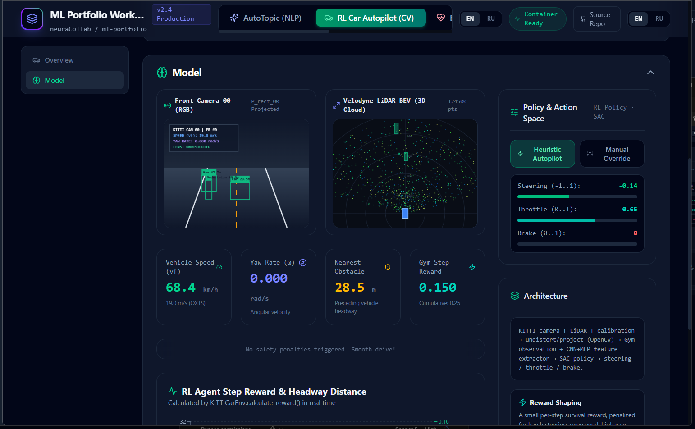

# ML Portfolio

**Four real ML systems in one live app** — not slides, not screenshots. Train a model, run
inference, and scale a real Kubernetes cluster, right from the browser.

🔗 **Live demo:** https://neuracollab.github.io/ml-portfolio/
🎥 **Video walkthrough:** https://youtu.be/4Eko7m_eC98

| | Project | What it actually does |
|---|---|---|
| 🧵 | **[AutoTopic](AutoTopic/README.md)** | Unsupervised topic discovery (BERTopic + UMAP + HDBSCAN) on 370K+ real logs, no manual labeling |
| 🚗 | **[RL Autopilot](rl_cv_car-autopilot/README.md)** | SAC reinforcement-learning driving policy fusing camera + LiDAR + IMU on real KITTI data |
| ❤️ | **[ECG Edge AI](raspberry-pi-ecg/README.md)** | Real AD8232 + Raspberry Pi 5 hardware, local PyTorch inference, no cloud |
| 🌐 | **[Cassandra + gRPC ML](cassandra-grpc-ml/README.md)** | Distributed ML serving on real Kubernetes: pod discovery, load balancing, live failure recovery |

One React frontend, one FastAPI backend, four real Python pipelines wired in end to end.



## Architecture

```
React + TypeScript + Vite frontend
        |  fetch() / WebSocket
        v
FastAPI backend  -->  AutoTopic, RL Autopilot, ECG adapters (each project's real code)
        |
        +--> Cassandra + gRPC ML gateway
                |
                +--> Cassandra (state, metadata) + HTTP --> Coordinator (real k8s pod)
                                                                     |
                                                                     +--> gRPC (round-robin)
                                                                          --> N real worker pods
                                                                              |
                                                                              +--> Cassandra (metadata)
                                                                              +--> MinIO (model artifact)
```

The backend is a thin adapter layer around each project's existing code — it does not
reimplement ML logic. Each project's own README below documents its ML approach, bugs found
and fixed, known limitations, and full API surface in detail.

## Projects

- **[AutoTopic](AutoTopic/README.md)** — BERTopic + UMAP + HDBSCAN topic discovery, run live via
  FastAPI on the bundled sample or an uploaded CSV.
- **[RL Autopilot](rl_cv_car-autopilot/README.md)** — OpenCV camera/LiDAR pipeline + Stable-Baselines3
  SAC policy; a real pretrained-policy inference demo runs against a bundled KITTI sample.
- **[ECG Edge AI](raspberry-pi-ecg/README.md)** — 4-block Conv1d TorchScript model, real AD8232 +
  Raspberry Pi 5 hardware path, CPU-only edge inference.
- **[Cassandra + gRPC ML](cassandra-grpc-ml/README.md)** — TF-IDF + LogisticRegression classifier
  served by a real Kubernetes worker pool behind a gRPC Coordinator, with Cassandra for
  state/metadata and MinIO for model artifacts.

## Installation

Requires Docker Desktop (the three ML projects pull in bertopic/sentence-transformers/torch/
stable-baselines3/opencv, which is impractical to install directly into a bare host Python).

```bash
git clone <this-repo>
cd ml-portfolio
docker compose build   # first build is slow (~10-15 min), pre-downloads NLP/embedding models
docker compose up
```

- Frontend: http://localhost:3000
- Backend: http://localhost:8000 (OpenAPI docs at `/docs`)

**Cassandra + gRPC ML needs one extra step** — it talks to a real local Kubernetes cluster
(`kind`). Without it, only that project's page is affected; the rest of the portfolio works
normally.

```bash
bash cassandra-grpc-ml/k8s/setup-kind.sh
docker compose up -d --build backend frontend
```

See `cassandra-grpc-ml/README.md` for setup details and teardown.

## Environment Variables

See `.env.example`, `backend/.env.example`, and `frontend/.env.example`. None of the four
projects need any API keys or credentials.

## Testing

```bash
# Backend + frontend
curl http://localhost:8000/api/health
cd frontend && npm install && npm run build   # type-checks (tsc) then builds
```

The first three projects (AutoTopic, RL Autopilot, ECG) have no automated test suite to
preserve — they were verified end-to-end through the browser. Cassandra + gRPC ML has a real
pytest suite, 63 tests total, across `cassandra-grpc-ml/worker/tests/` (12),
`cassandra-grpc-ml/coordinator/tests/` (23), and `backend/tests/` (28). Run each in a throwaway
container, e.g.:

```bash
docker run --rm -v "$(pwd)/cassandra-grpc-ml/worker:/app" -w /app python:3.11-slim \
  bash -c "pip install --no-cache-dir -q scikit-learn numpy pytest joblib && pytest -v"
```
