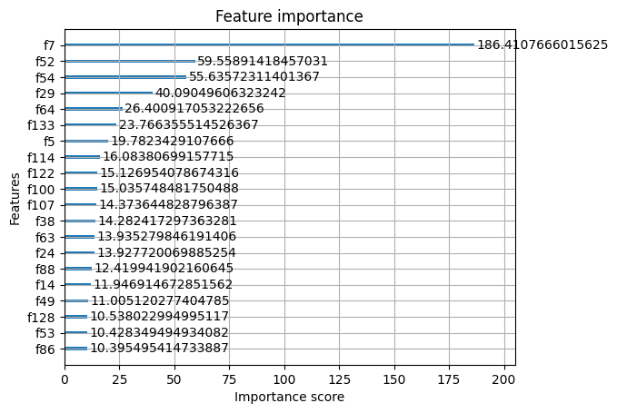

# 🔍 Learning to Rank (LTR): Построение систем ранжирования на данных MSLR-WEB10K

здесь можно скачать зипку с датасетом: https://www.microsoft.com/en-us/research/project/mslr/

Этот проект посвящен разработке моделей машинного обучения для задачи **Learning to Rank (LTR)**. Цель — научить алгоритм упорядочивать документы по их релевантности поисковому запросу, используя классические признаки информационного поиска.

## 🎯 Цели проекта
- Реализовать пайплайн загрузки и обработки специфических данных в формате `svmlight`.
- Обучить и сравнить современные алгоритмы ранжирования: **XGBoost (Pairwise)** и **CatBoost (YetiRank)**.
- Провести автоматизированный подбор гиперпараметров с помощью **Optuna**.
- Оценить качество системы с использованием метрики **NDCG@10** на полной 5-фолдовой кросс-валидации.

## 📊 Датасет: Microsoft MSLR-WEB10K
В работе использован стандартный бенчмарк **MSLR-WEB10K**, содержащий:
*   **30,000+ запросов** и соответствующие им пары запрос-документ.
*   **136 признаков**, включая классические метрики: BM25, TF-IDF, LMIR, PageRank и др.
*   **Шкала релевантности:** от 0 (нерелевантно) до 4 (идеальное совпадение).

## 🛠 Стек технологий
*   **Модели:** `XGBoost` (XGBRanker), `CatBoost` (CatBoostRanker).
*   **Оптимизация:** `Optuna`.
*   **Метрики:** `Scikit-learn` (NDCG).
*   **Данные:** `Scipy`, `Numpy`, `Pandas`.

## 📈 Ключевые этапы реализации

### 1. Обработка групповой структуры
В отличие от классической классификации, в LTR данные жестко привязаны к `query_id`. 
- Реализована загрузка данных с сохранением идентификаторов запросов.
- Выполнена корректная группировка для `XGBoost` (`group` параметр) и `CatBoost` (`Pool` с `group_id`).

### 2. Сравнение моделей (Baseline)
Были протестированы два подхода к функциям потерь:
*   **XGBoost (rank:pairwise):** Минимизация количества инверсий в парах документов.
*   **CatBoost (YetiRank):** Современный метод, оптимизирующий взвешенную попарную логистическую функцию потерь для аппроксимации NDCG.

### 3. Гиперпараметрическая оптимизация
С помощью библиотеки **Optuna** проведен поиск оптимальных параметров (`max_depth`, `learning_rate`, `subsample` и др.). Целевой метрикой при поиске выступал **NDCG@10**.

### 4. Финальная валидация (5-Fold CV)
Для исключения случайности и переобучения проведена полная кросс-валидация по всем 5 фолдам датасета. На каждой итерации модель обучалась на 4 фолдах и тестировалась на 5-м.

## 🏆 Результаты

### Итоговые метрики
*   **Средний NDCG@10 (Full CV):** `0.6042`
*   **Стабильность (Std):** `± 0.0036`

### Анализ важности признаков (Feature Importance)
Визуализация важности признаков по критерию `Gain` (XGBoost) показала доминирующее влияние следующих факторов:
1.  **f7 (BM25 в теле документа):** Фундаментальный признак текстовой релевантности.
2.  **f52, f54 (LMIR):** Языковые модели для информационного поиска.
3.  **f29:** Вероятностные модели покрытия терминов.

  

## 🚀 Примеры использования (Инференс)
Пример ранжирования тестового запроса:
```python
# Предсказание баллов релевантности
preds = best_model.predict(X_test)

# Итоговый NDCG@10 на тесте
score = calculate_ndcg(y_test_grouped, preds_grouped, k=10)
print(f"Result: {score:.4f}")
```
