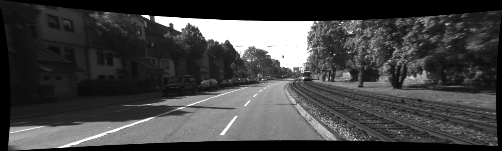

## RL Car Autopilot on KITTI (Sensor Fusion & Reinforcement Learning Playground)

## Overview

This project demonstrates end-to-end work with raw autonomous-driving sensor data (the KITTI
dataset): multi-modal data handling (camera, LiDAR, IMU/GPS), camera calibration and 3D-to-2D
LiDAR point projection, and building a custom `Gym` environment to train a reinforcement-learning
agent (`Stable-Baselines3` SAC/DDPG) on combined observations (an image crop plus a numeric
sensor vector).

Main script: `anomaly_detection.py`.

### What's implemented
- **Data loading/extraction**: auto-detects a `.zip` next to the script and extracts it.
- **KITTI camera images**: reads camera frames, converts BGR->RGB, basic visualization.
- **Image dataset assembly**: aggregates frames from `image_00`, `image_01`, ... into a single
  `numpy` array.
- **OXTS (IMU/GPS) parsing**: reads the KITTI OXTS text format and timestamps into a structured
  `pandas.DataFrame`.
- **LiDAR (Velodyne) reading**: unpacks `*.bin` point-cloud scans and renders a bird's-eye-view
  (BEV) visualization.
- **Tracklets (object annotations)**: parses `tracklet_labels.xml` into a tabular form.
- **Calibration parsing**: `calib_cam_to_cam.txt`, `calib_velo_to_cam.txt`,
  `calib_imu_to_velo.txt`; builds the rotation/translation matrices and the full 4x4 `Tr`
  transform.
- **Image undistortion**: removes lens distortion given the camera's intrinsic/distortion
  parameters.



- **LiDAR -> camera projection**: transforms LiDAR points into camera coordinates and projects
  them to pixel space via the rectified projection matrix `P_rect`.
- **`Gym` environment**: `KITTICarEnv` with a multi-modal observation -- `image` (84x84x3) +
  `vector` (speed, yaw rate, geometry of the nearest target, etc.).
- **Reward shaping**: a simple reward that rewards staying in a target speed range and
  penalizes harsh steering, dangerous proximity to obstacles, and high angular velocity.
- **RL model**: `SAC` with `MultiInputPolicy` and a custom `CombinedExtractor` (a CNN branch for
  the image, an MLP branch for the vector).
- **Inference/render**: an online renderer that overlays projected LiDAR points on the camera
  frame; a Full-HD video export mode.

### Skills demonstrated
- **Computer vision & sensor fusion**: OpenCV, camera calibration handling, 3D->2D projection,
  lens undistortion.
- **Data engineering**: `numpy`/`pandas`, parsing KITTI's XML/text formats, timestamp
  synchronization across sensors.
- **RL engineering**: observation/action space design, reward shaping, integration with
  `Stable-Baselines3` (SAC/DDPG) via the `Gym` API.
- **Experiment tooling**: BEV/LiDAR-overlay visualization, video rendering, tracklet labeling.

## Tech Stack

| Category | Library / Tool |
|---|---|
| Computer vision | OpenCV (`cv2`) |
| Data processing | NumPy, pandas, `xml.etree` |
| RL framework | OpenAI Gym (`gym`), Stable-Baselines3 (SAC, DDPG) |
| Deep learning | PyTorch (`torch`, `torch.nn`) -- custom CNN+MLP feature extractor |
| Visualization | Matplotlib |
| Dataset | KITTI Raw (camera, Velodyne LiDAR, OXTS IMU/GPS, tracklet annotations) |

---

## Quick Start

### 1) Dependencies
Python 3.10-3.11 is recommended.

```bash
python -m venv .venv
.venv\Scripts\activate  # Windows PowerShell
python -m pip install --upgrade pip
pip install numpy opencv-python matplotlib pandas gym==0.26.2 gym-notices torch torchvision torchaudio stable-baselines3[extra]
```

Notes:
- For CUDA, install a matching `torch` build per the official PyTorch instructions.
- If you have Gym v1+, make sure it's compatible with your Stable-Baselines3 version (this
  project targets the Gym v0.26+ API).

### 2) KITTI data
Download the KITTI Raw dataset (scene `2011_09_26_drive_0001_sync`) and its calibration files.
Expected directory layout:

```
./2011_09_26/
  calib_cam_to_cam.txt
  calib_velo_to_cam.txt
  calib_imu_to_velo.txt
  /2011_09_26_drive_0001_sync/
    /image_00/data/*.png
    /image_01/data/*.png
    /oxts/data/*.txt
    /oxts/timestamps.txt
    /velodyne_points/data/*.bin
    /velodyne_points/timestamps.txt
    tracklet_labels.xml
```

Alternative: place a `.zip` with this structure next to `anomaly_detection.py` -- the script
will extract it into the current directory automatically.

### 3) Run training + render

```bash
python anomaly_detection.py
```

The script will:
- load the data and calibration files;
- build the `KITTICarEnv`;
- run a short `SAC` training loop (~1000 steps in the example);
- run a rollout with rendering and LiDAR-point projection overlaid on the image.

To only test a pretrained model (and export a Full-HD video), use the `test_trained_model`
function defined at the end of the file -- adjust the model/normalization/video paths in its
call arguments.

---

## Key Components (at a glance)
- `create_image_dataset` -- aggregates camera frames into a `numpy` array.
- OXTS parsing -- builds a `DataFrame` of physical quantities with timestamps.
- LiDAR `*.bin` parsing -- into `N x 4 (x, y, z, intensity)` arrays, plus a BEV plotter.
- `parse_calib_*` -- reads calibration files, assembles `R`, `T`, `P_rect`, and the 4x4 `Tr`.
- `undistort_image` -- removes lens distortion given `K` and `D`.
- `velo_to_cam` and `project_to_image` -- project LiDAR points onto the camera image.
- `KITTICarEnv` -- the environment with `[image, vector]` observations, a simple reward, and
  an overlay renderer.
- `CustomCombinedExtractor` -- the CNN+MLP feature extractor used by `SAC`'s `MultiInputPolicy`.

---

## Common Issues
- "File not found": check the paths to `2011_09_26/...` and the `calib_*.txt` files.
- OpenCV `highgui` windows won't open: run locally (not in a headless environment), or comment
  out `imshow` calls and save frames/video to disk instead.
- Gym/SB3 version mismatch: use Gym 0.26.x with a compatible, current Stable-Baselines3
  (`[extra]`).
- CUDA/torch: pick versions from PyTorch's official compatibility matrix.

---

## Data License
KITTI Raw belongs to its dataset authors and is distributed under their terms. This repository
contains only code -- the dataset itself must be downloaded separately from the official source.
